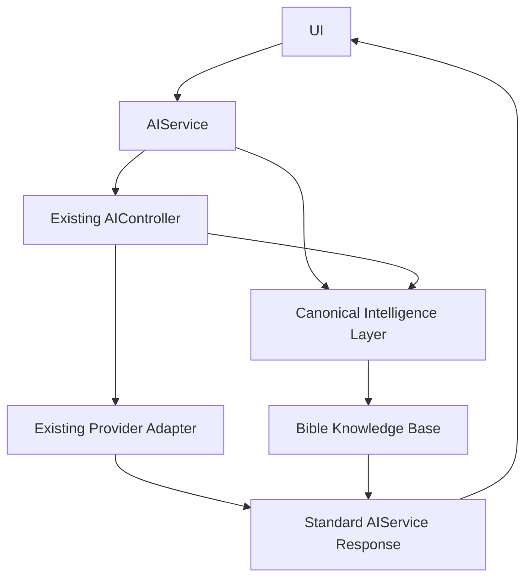

# AI Service Layer

Phase 002 menetapkan `src/ai/ai-service.js` sebagai satu-satunya pintu masuk
untuk capability AI. UI tidak boleh mengimpor controller, provider, prompt,
gateway CIL, atau knowledge engine secara langsung.

## Architecture



`AIService` tidak mengetahui provider konkret. Provider dipilih oleh
`AIController` melalui adapter yang sudah ada.

## Public capabilities

| Method | Existing engine/path | Status |
| --- | --- | --- |
| `summary(target)` | intent `summary` | Implemented |
| `summarize(target)` | alias kompatibilitas `summary` | Implemented |
| `ask(question)` | intent `qa` | Implemented |
| `reflect(target)` | intent `reflection` | Implemented |
| `reflectJournal(target)` | intent `journal-reflection` + consent | Implemented |
| `review(target)` | existing Reflection Engine | Implemented |
| `search(query)` | intent `search` (LLM synthesis) | Implemented |
| `semanticSearch(query)` | CIL Semantic Search | Implemented |
| `explain(question)` | intent `explain` | Implemented |
| `wisdom(target)` | existing intent/prompt `wisdom` | Implemented |
| `crossReference(target)` | CIL canonical context crossrefs | Implemented |
| `buildCanonicalContext(input)` | CIL Gateway | Implemented |
| `prayer()` | Prayer Engine tidak ada | Safe `not_implemented` |

Utility non-generatif (search preferences, suggestions, analytics, events)
tetap tersedia melalui facade yang sama.

## Standard response

```js
{
  success: true,
  status: "success", // success | error | not_implemented
  provider: "mock",  // null untuk error; "local" untuk path CIL lokal
  source: "ai-controller",
  citation: null,    // citation pertama untuk convenience
  citations: [],
  content: "…",
  metadata: {
    method: "ask",
    durationMs: 42
  },
  error: null,
  timestamp: "2026-07-17T00:00:00.000Z"
}
```

Response juga mempertahankan field engine lama di top level, misalnya
`results`, `analysis`, `crossrefs`, `confidence`, dan `guardrails`. Ini menjaga
kompatibilitas UI tanpa membuat format baru per feature.

## Safe error response

Capability utama tidak melempar exception ke UI. Error dikonversi menjadi:

```js
{
  success: false,
  status: "error",
  provider: null,
  source: "ai-controller",
  citation: null,
  citations: [],
  content: "Permintaan belum lengkap atau tidak valid.",
  metadata: { method: "ask", durationMs: 0 },
  error: {
    code: "INVALID_REQUEST",
    message: "Permintaan belum lengkap atau tidak valid.",
    retryable: false,
    status: null,
    details: null
  },
  timestamp: "…"
}
```

## Error codes

| Service code | Meaning |
| --- | --- |
| `AI_UNAVAILABLE` | Provider/service tidak tersedia |
| `PROVIDER_TIMEOUT` | Provider timeout |
| `INVALID_REQUEST` | Input tidak valid/kosong |
| `KNOWLEDGE_UNAVAILABLE` | Canonical knowledge/context gagal |
| `RATE_LIMIT` | Terlalu banyak request |
| `QUOTA_EXCEEDED` | Kuota provider habis |
| `CANCELLED` | Request dibatalkan |
| `NOT_IMPLEMENTED` | Engine belum tersedia |

## Logging

- Development (`localhost`): debug/info/warn/error dengan metadata teknis yang
  tidak memuat prompt atau isi jurnal.
- Production: detail error tidak dicetak; logger hanya mencetak pesan generik.
- Response production tidak menyertakan `error.details`.

## UI boundary

Contract test memeriksa file UI AI agar tidak mengimpor:

- `ai-controller.js`
- `cil/gateway.js`
- `prompt-builder.js`
- `providers/*`

Semua UI mengakses capability melalui `AIService`.

## Compatibility

Phase 002 tidak mengubah UI, CIL, Bible Knowledge Base, prompt, atau RAG.
`summarize()` dipertahankan sebagai alias karena dipakai Phase 001. Semantic
Search dan Canonical Context mempertahankan field hasil lama untuk UI yang
sudah ada.
