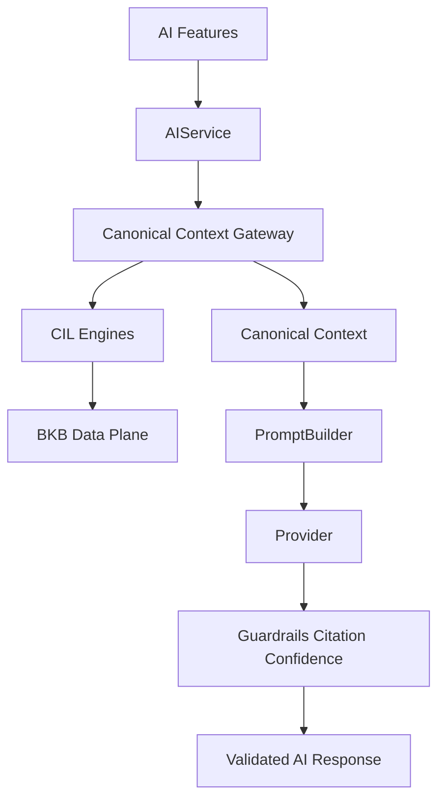

# CIL Architecture — Canonical Intelligence Layer (CI-01)

## Purpose

CIL is the **only runtime gateway** between AI features and biblical knowledge.
Providers never see raw BKB handles or database objects — only token-budgeted
`CanonicalContext` slices with verified citations and confidence metadata.

## Data flow



## Canonical IDs

Language-independent IDs (legacy IDs preserved in `meta.legacyId`):

- `book:proverbs`, `chapter:proverbs.01`, `ref:proverbs.1.7`
- `topic:wisdom`, `doctrine:fear-of-the-lord`, `character:solomon`
- `timeline:hezekiah-collection`, `symbol:path`, `wisdom-pattern:situational-pair`
- `application:proverbs.01`

## Engines (`src/ai/cil/`)

| Engine | Role |
|--------|------|
| CanonicalEngine | Parse/normalize references; book/chapter metadata |
| TopicEngine | Parent/children/related/opposite traversal |
| RelationshipEngine | Typed relations + “why related” |
| KnowledgeGraphEngine | Book-agnostic nodes, neighbors, paths, subgraphs |
| Doctrine / Character / Timeline / Symbol / Wisdom / Application | Domain queries |
| CitationEngine | Extract + verify references against canon + allowed context |
| TheologicalGuardrails | Post-provider validation + safe fallback |
| CanonicalContextGateway | `buildCanonicalContext`, retrieval, semantic search facades |

## Runtime migration rules

1. `AIController` always builds context via `CanonicalContextGateway`.
2. `RetrievalEngine` and `ContextBuilder` are compatibility delegates — they do **not** read `CONTENT` or BKB for normal requests.
3. `CONTENT` remains for non-AI UI (day/calendar/reading plan) and **explicit degraded fallback** only (`degraded: true`, reduced confidence).
4. Outside `src/ai/cil/**` and `src/ai/knowledge/**`, runtime AI modules must not import BKB engines directly (`scripts/validate-cil.mjs` enforces this).
5. Journal excerpts stay a private side channel: stored consent required; never indexed, cached, persisted, or added to graph metadata.

## Fallback chain

1. CIL + BKB (normal)
2. Legacy CONTENT adapter with `degraded: true`
3. Safe no-context / guardrail local fallback from canonical sections

Never invent missing doctrine or history.

## Confidence (0–100)

- Knowledge coverage 25%
- Cross-reference strength 20%
- Commentary support 10%
- Historical support 10%
- Semantic confidence 20%
- Canonical consistency 15%

Penalties apply for degraded mode, invented refs, missing scripture, absolute application language.

## Guardrails

For guarded intents, streaming output is buffered until validation completes; only the validated final response is emitted. Failures produce a local fallback built from canonical sections and verified citations.

## Offline / progressive load

- Core: canon + topics + reference + graph indexes load with `initCIL()`.
- Domains: doctrine/character/timeline/symbol/wisdom/application load on first use (also embedded in `knowledge.min.json` for offline).
- Service worker `bibletime-v8-cil-ci01` precaches CIL runtime, core indexes, and domain artifacts.

## Public API

```js
await AIService.initCIL();
await AIService.buildCanonicalContext({ chapter: 1, intent: "qa" });
AIService.cil(); // read-only engine facades
await AIService.semanticSearch("hikmat"); // via gateway
```

## Verification

```bash
npm run test-cil
npm test
```

Artifacts: `scripts/test-cil-*.mjs`, `scripts/validate-cil.mjs`.
