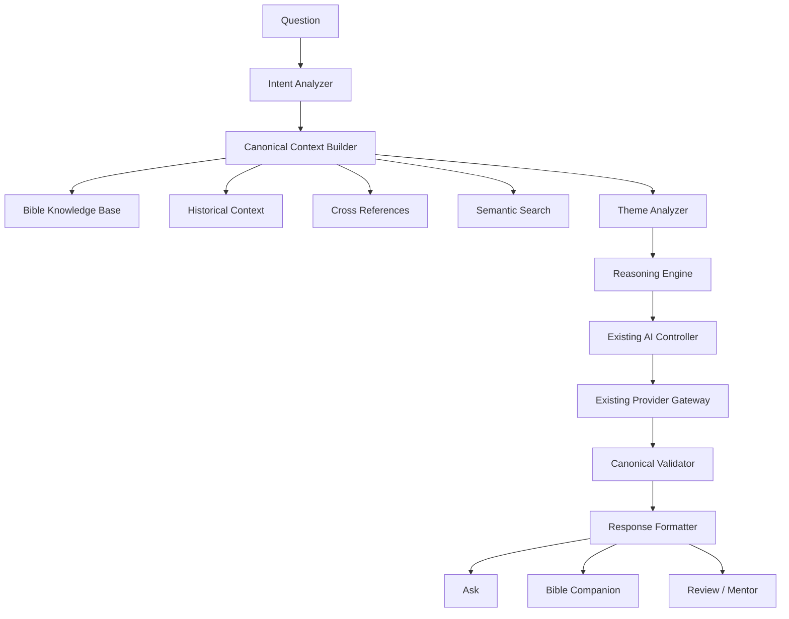

# Biblical Reasoning Engine

Phase 006 adds a deterministic canonical reasoning pipeline above the existing
Canonical Intelligence Layer (CIL). It does not replace the AI Gateway, Bible
Knowledge Base (BKB), semantic retrieval, provider adapters, RAG path, or AI
Service contract.

## 1. Purpose

The Biblical Reasoning Engine ensures every AI answer passes through canonical
evidence before language synthesis:

- BKB is the primary source of truth
- CIL selects and bounds the context
- Reasoning Engine defines the thinking path
- LLM only phrases language from that evidence

## 2. Architecture



## 3. Reasoning Pipeline

1. Validate and normalize the question.
2. Classify intent offline.
3. Build one immutable `CanonicalContext` through CIL.
4. Project themes, keywords, historical evidence, citations, cross-references,
   purpose, memory verse, application, and prayer.
5. Connect only themes already present in canonical evidence.
6. Reuse the existing `qa` intent for language synthesis when online.
7. Validate provider citations and metadata consistency.
8. Format the standard response schema.
9. Fall back to local canonical evidence when the provider is unavailable.

## 4. Intent Analyzer

`src/ai/reasoning/intent-analyzer.js` recognizes:

- Meaning
- Application
- Reflection
- Historical
- Character Study
- Theme
- Cross Reference
- Promise
- Warning
- Command
- Prayer
- Wisdom
- Timeline
- Doctrine
- Prophecy
- Place
- General Question

Unrecognized questions fall back to `general`.

## 5. Context Builder

`src/ai/reasoning/reasoning-context.js` reuses the existing CIL gateway once and
projects:

- book, chapter, verse
- summary and purpose
- themes and keywords
- historical context
- memory verse
- cross references
- citations
- application / challenge
- prayer
- metadata and availability

No duplicate Knowledge Base query is performed when a prebuilt `canonical`
context is supplied by Companion or Review.

## 6. Theme Analysis

`src/ai/reasoning/theme-reasoner.js` links only themes already present in the
canonical evidence. It never invents new theological claims or editorial themes.

## 7. Canonical Validation

`src/ai/reasoning/canonical-validator.js` checks:

- citation availability
- chapter/book context boundaries
- metadata consistency
- invented reference rejection
- theological guardrail status
- metadata-only / degraded context

Statuses: `pass`, `fallback`, `warn`, `insufficient_context`, `blocked`,
`invalid_context`.

## 8. Explainable AI

Internal reasoning metadata includes:

- intent and intent confidence
- primary theme and theme list
- knowledge source
- historical context used
- cross references used
- confidence
- reasoning path
- context sources and references used
- canonical-only / degraded flags

This metadata is internal evidence, not chain-of-thought and not a system
prompt. The UI may show a concise **Dasar Jawaban** panel without exposing
credentials, API keys, or prompt templates.

## 9. Output Schema

```js
{
  summary: "…",
  answer: "…",
  application: "…",
  cross_references: [],
  historical_context: "…",
  memory_verse: { ref: "…", text: "…" } | null,
  prayer: "…",
  next_step: "…",
  citation: { display: "…" } | null,
  citations: [],
  confidence: 0,
  provider: "local | mock | …",
  reasoning_metadata: {
    intent: "meaning",
    theme: "…",
    knowledge_source: "cil",
    historical_context_used: true,
    cross_references_used: 2,
    confidence: 70,
    reasoning_path: ["intent", "canonical_context", "…"]
  },
  timestamp: "ISO-8601",
  reasoning: [],
  themes: [],
  validation: { valid: true, status: "pass", checks: [] },
  explainability: { /* public evidence subset */ }
}
```

## 10. Integration

### Ask

`AIService.ask()` and `AIService.reason()` already route through
`runBiblicalReasoning()`.

### Bible Companion

`runBibleCompanion()` builds one CIL context, then calls
`runBiblicalReasoning()` with that prebuilt context. Companion no longer calls
the LLM summary path directly.

### Review / Mentor

`runReview()` follows:

Reflection → Canonical Context → Biblical Reasoning → Review formatting.

Provider enrichment is mediated by the Reasoning Engine. Canonical-only output
remains available offline.

## 11. Performance

- one CIL context build per request when possible
- prebuilt `canonical` reuse for Companion and Review
- existing controller cache/persist options remain available
- lazy controller import inside the reasoning engine

## 12. Security

Never sent to the client:

- system prompts
- provider prompt templates
- API keys
- credentials
- hidden chain-of-thought

Public reasoning fields are evidence summaries only.

## 13. Future Roadmap

- curated chapter content for books currently marked `metadata-only`
- richer theme graph edges from reviewed BKB metadata
- pericope and place DTOs when those datasets exist
- doctrine validation against reviewed interpretive notes
- advanced/debug UI for validation checks without exposing prompts
