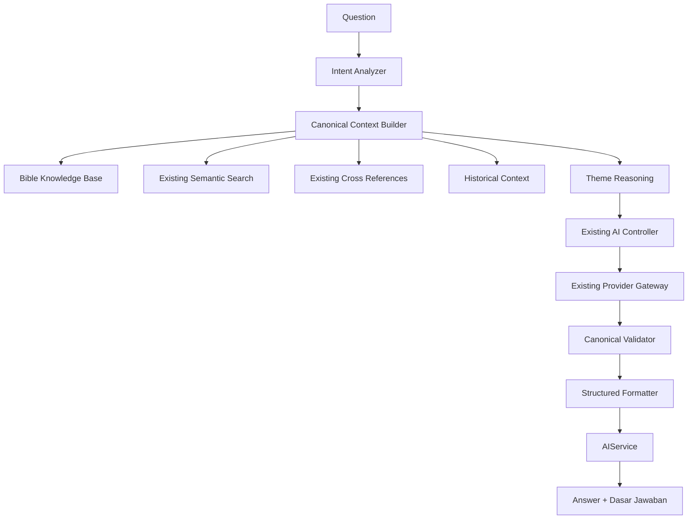

# Biblical Reasoning Engine

Phase 006 adds a deterministic canonical reasoning pipeline above the existing
Canonical Intelligence Layer (CIL). It does not replace the AI Gateway, Bible
Knowledge Base (BKB), semantic retrieval, provider adapters, or RAG path.

## 1. Overview

`AIService.ask()` and `AIService.reason()` now use the Biblical Reasoning
Engine. The BKB remains the source of evidence; an LLM is used only to phrase a
direct answer from the context selected by CIL.

The engine provides:

- biblical intent classification
- one canonical context build per request
- canonical theme relationships
- historical and cross-reference evidence
- post-provider canonical validation
- structured output and explainable evidence metadata
- canonical-only fallback when the provider is unavailable

## 2. Architecture



The prebuilt `CanonicalContext` is passed to `AIController.execute()`. This
prevents the controller from performing the same CIL query a second time while
preserving its cache, provider abstraction, citation checks, and guardrails.

## 3. Reasoning Pipeline

1. Validate and normalize the question.
2. Classify the question with the offline Intent Analyzer.
3. Build one immutable `CanonicalContext` through CIL.
4. Project themes, people, places, keywords, historical evidence, citations,
   cross-references, application, and prayer.
5. Connect only themes already present in canonical evidence.
6. Reuse the existing `qa` intent and provider adapter for language synthesis.
7. Validate provider citations and guardrail status against canonical context.
8. Format the answer and evidence metadata.
9. Use a local canonical fallback when the provider fails or validation blocks
   the generated answer.

The public `reasoning` field is an evidence summary. It contains pipeline
stages, evidence labels, and validation results—not private chain-of-thought or
internal prompt content.

## 4. Intent Analysis

`src/ai/reasoning/intent-analyzer.js` classifies:

- `meaning`
- `application`
- `doctrine`
- `historical`
- `character`
- `place`
- `promise`
- `warning`
- `command`
- `prayer`
- `wisdom`
- `cross_reference`
- `timeline`
- `prophecy`
- `theme`
- `general`

Classification is deterministic and offline. The result includes the primary
intent, secondary matches, matched public markers, language, and confidence.
Intent analysis does not call a provider.

## 5. Context Builder

`src/ai/reasoning/reasoning-context.js` calls the existing CIL Gateway and
projects a compact evidence object:

- book, chapter, and verse reference
- summary
- themes and keywords
- people and places when present
- historical context
- cross-references
- citations
- application and prayer
- context sources used
- availability and degraded state

The context builder does not directly modify or duplicate BKB data. Metadata-
only books remain explicit and never inherit Proverbs content.

## 6. Canonical Validation

`src/ai/reasoning/canonical-validator.js` runs after provider synthesis and
checks:

- canonical book/chapter resolution
- scripture citation presence
- absence of invented references
- existing theological guardrail status
- allowed-citation boundaries
- metadata-only or degraded context

Possible statuses are:

- `pass`
- `fallback`
- `warn`
- `insufficient_context`
- `blocked`
- `invalid_context`

`blocked` and `invalid_context` outputs never deliver unvalidated provider
prose. The formatter uses the existing local guardrail fallback instead.

## 7. Explainable AI

Every successful reasoning response includes:

- detected intent and confidence
- reasoning path stage names
- canonical context sources used
- references used
- canonical-only and degraded flags
- validation checks and status

The UI renders a concise **Dasar Jawaban** disclosure containing themes,
supporting citations, context, cross-references, historical context, and
confidence. It never renders system prompts, provider prompts, API keys,
credentials, or hidden model reasoning.

## 8. Output Schema

```js
{
  summary: "…",
  reasoning: [
    { stage: "intent", explanation: "…", evidence: [] },
    { stage: "canonical_context", explanation: "…", evidence: [] },
    { stage: "theme_analysis", explanation: "…", evidence: [] },
    { stage: "cross_references", explanation: "…", evidence: [] },
    { stage: "canonical_validation", explanation: "…", evidence: [] }
  ],
  themes: [],
  theme_path: [],
  historical_context: "…",
  cross_references: [],
  application: "…",
  prayer: "…",
  citations: [],
  confidence: 0,
  provider: "mock | local | …",
  timestamp: "ISO-8601",
  validation: { valid: true, status: "pass", checks: [] },
  explainability: {
    intent: "meaning",
    intent_confidence: 0.78,
    reasoning_path: [],
    context_used: [],
    references_used: [],
    canonical_only: false,
    degraded: false
  }
}
```

The standard AIService envelope (`success`, `status`, `source`, `content`,
`metadata`, and `error`) wraps these fields without removing them.

## 9. Future Enhancement

- Add curated chapter and verse data for books currently marked
  `metadata-only`.
- Expand canonical theme relationships from reviewed BKB graph edges.
- Add explicit pericope and place DTO fields when those datasets are available.
- Add interpretation-aware doctrine validation using reviewed metadata.
- Support advanced/debug UI for validation checks without exposing prompts.
