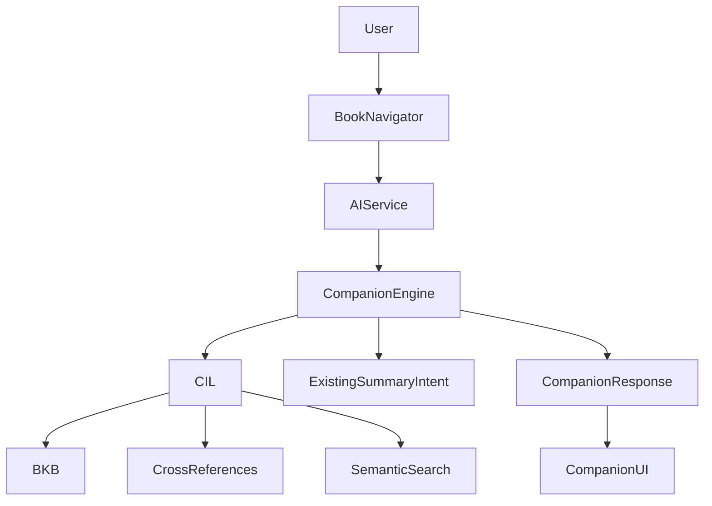

# Multi-Book Bible Companion

Phase 005 expands Bible Time from a Proverbs-only reader architecture into a
canonical, multi-book Bible Companion. The registry covers all 66 Protestant
canonical books. Curated chapter content remains availability-aware: Proverbs
is production-ready and offline; the other books currently expose canonical
metadata without fabricated chapter content.

## 1. Overview

The implementation reuses the existing Canonical Intelligence Layer (CIL),
Bible Knowledge Base (BKB), AI Service Layer, provider gateway, Review Engine,
and Bible Mentor. No new model or provider path was introduced.

Core capabilities:

- 66-book canonical registry with aliases and metadata
- generic `book + chapter` knowledge keys
- deep links through `/companion/:book/:chapter`
- Book and Chapter selectors
- structured Bible Companion output
- cross-book references
- whole-BKB semantic search
- explicit metadata-only offline fallback

## 2. Architecture



`src/ai/companion/companion-engine.js` is an orchestrator, not a new AI engine.
It uses one canonical context and may invoke the existing `summary` intent when
curated chapter content is available.

## 3. Book Registry

Source: `knowledge/canon/books-registry.json`

The registry is canonically ordered and contains:

- `bookId`
- `osis`
- `slug`
- Indonesian and English names
- `shortName` and aliases
- testament
- total chapters
- authorship metadata
- broad period
- category and genre
- original language
- canonical order
- status

Status values:

- `production`: curated chapter content is included offline
- `seed`: canonical metadata exists, but curated chapter content is not yet
  shipped

The current registry contains 66 books. Only Proverbs is `production`; this is
intentional data-integrity behaviour, not a UI limitation.

## 4. Knowledge Base

`KnowledgeBase.getChapter(chapter, book)` now keys chapter bundles by both book
and chapter. This prevents collisions such as Proverbs 1 and Psalms 1 when
future book data is imported.

The build pipeline:

1. reads the single canonical registry
2. emits 66 `canon-book` documents
3. builds aliases and OSIS indexes
4. places chapter nodes under their actual canonical book
5. exports the registry in `knowledge.min.json` and `canon-index.json`

The schema remains generic (`book`, `chapter`, `verse`, `topic`, `crossref`,
and domain documents). Future books can use the same document shape without
duplicating engines.

## 5. Navigation

Route:

```text
/companion/:book/:chapter
```

Examples:

```text
/companion/proverbs/1
/companion/psalms/23
/companion/james/1
```

`js/ui/bible-companion.js` provides:

- testament-grouped Book Selector
- bounded Chapter Selector
- Book Overview
- Book Summary / chapter summary
- Cross Book References
- application and prayer

Both selectors have accessible labels and use native controls. Navigation is
handled by the existing History API router, including Back, Forward, refresh,
and deep links.

The existing 31-day Proverbs Journey is preserved. Selecting an available
Proverbs chapter provides a direct link to that lesson.

## 6. Cross References

The CIL gateway now resolves cross-reference sources through the Canonical
Engine instead of matching the literal word `Amsal`. This makes source matching
book-agnostic.

Bible Companion filters the current book out of `cross_book_references` and
deduplicates identical source-target pairs. Proverbs currently links to books
such as Psalms, James, Matthew, and Romans from the curated cross-reference
dataset.

## 7. Semantic Search

Semantic Search already ranks the complete BKB. Phase 005 adds all registry
books as `canon-book` documents, so searches such as “Mazmur” return canonical
book metadata and relevant cross-book references even when chapter content is
not yet packaged.

Search remains offline-first and uses the existing index, graph ranking, cache,
and query analyzer.

## 8. Bible Companion

Public AIService methods:

```js
await AIService.books();
await AIService.book("Mazmur");
await AIService.companion({ book: "proverbs", chapter: 1 });
```

Structured Companion output:

```js
{
  book,
  chapter,
  available,
  availability,          // "available" | "metadata-only"
  status_message,
  overview,
  summary,
  purpose,
  themes,
  historical_context,
  cross_book_references,
  related_verses,
  application,
  prayer,
  citations,
  confidence,
  provider,
  canonical_only,
  timestamp
}
```

For metadata-only books, the Companion does not call the LLM and does not
borrow Proverbs content. It returns the registered book metadata and a clear
offline availability message.

## 9. Future Expansion

To add a production book:

1. curate licensed book/chapter/verse documents
2. set `meta.bookSlug` and canonical references
3. add historical, topic, application, and cross-reference metadata
4. validate citations
5. mark the registry entry `production`
6. rebuild the BKB

The architecture is ready for 66 books and chapter/verse scale, but the full
31,102-verse corpus is deliberately not bundled until an appropriate licensed
source and per-book offline packaging strategy are provided. Future scaling
should use per-book lazy artifacts rather than loading the full corpus at once.
