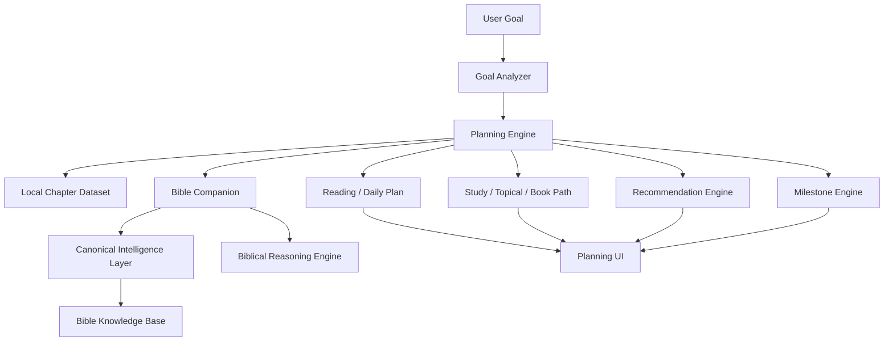

# Planning & Discipleship Engine

## 1. Overview

Phase 007 adds an offline-first orchestration layer that turns a learning goal
into a reusable Bible study journey. It uses the existing editorial dataset,
Bible Companion, Canonical Intelligence Layer, and Biblical Reasoning Engine.
It does not create a new AI, change BKB data, or modify canonical reasoning.

## 2. Goals

The deterministic Goal Analyzer recognizes:

- Learn Wisdom
- Character Study
- Book Study
- Daily Reading
- Topical Study
- Spiritual Growth
- Memorization
- Prayer
- Leadership
- Discipleship
- General Learning

Topical detection supports prayer, forgiveness, hope, marriage, parenting,
work, leadership, wisdom, and faith using terms already present in local
chapter content.

## 3. Planning Architecture

The Planning Engine is rule-based. Bible Companion supplies one canonical
context and reuses the Reasoning Engine without a second BKB query.

## 4. Goal Analyzer

`src/ai/planning/goal-analyzer.js` uses deterministic Indonesian and English
markers. Unknown input becomes `general_learning`. It returns a normalized
goal, optional topic, secondary matches, and classification confidence.

No goal or reading history is sent to a provider.
Provider-assisted Companion wording is explicit opt-in (`llmEnabled: true`) and
receives chapter context only; plan goals and completion history remain local.

## 5. Reading Plan

Every lesson contains:

- book and chapter
- estimated reading time
- objective
- reflection
- prayer
- application
- memory verse
- review prompt
- milestone marker

The plan-level schema includes:

- `plan_id`
- `title`
- `goal`
- `duration`
- `difficulty`
- `lessons`
- `reflection`
- `prayer`
- `application`
- `memory_verse`
- `review`
- `milestones`
- `completion`

Daily plans reuse the same immutable lesson objects.

## 6. Study Plan

Study paths are built only from themes present in selected chapter content.
Topical plans rank existing chapters using title, theme, keywords, and summary.
Book plans add canonical overview, purpose, reading order, major themes, review
checkpoints, and completion target.

Supported durations are configurable from 1–31 lessons. The UI exposes 7, 14,
21, and 31.

## 7. Recommendation Engine

The Recommendation Engine considers:

- current lesson
- completed lessons
- current theme
- selected plan
- Bible Companion context
- reasoning metadata when available

It returns the next unfinished lesson, review status, next milestone, theme,
and a local source explanation. Completed lesson history remains local.

## 8. Milestones

Default configurable milestones:

- 7 Lesson
- 14 Lesson
- 21 Lesson
- 31 Lesson
- Book Complete
- Theme Complete
- Plan Complete

Each milestone exposes target, progress, percentage, and status.

## 9. Offline Strategy

- Plans are generated from `data/content.js`.
- Bible Companion and Reasoning run with canonical-only fallback.
- Plan skeletons are cached in memory and local storage.
- Progress and recommendations are recalculated from local completion state.
- Storage failure or corrupt cache triggers deterministic regeneration.
- No provider is required for planning.

Service Worker cache version `bibletime-v29-planning-discipleship` precaches the
planning engine and UI modules.

## 10. Future Expansion

- Add curated plans when more books receive production knowledge bundles.
- Add user-controlled plan export/import.
- Add calendar scheduling without changing canonical lesson content.
- Add cross-book topical paths after reviewed chapter datasets are available.
- Add optional local reminder preferences.
