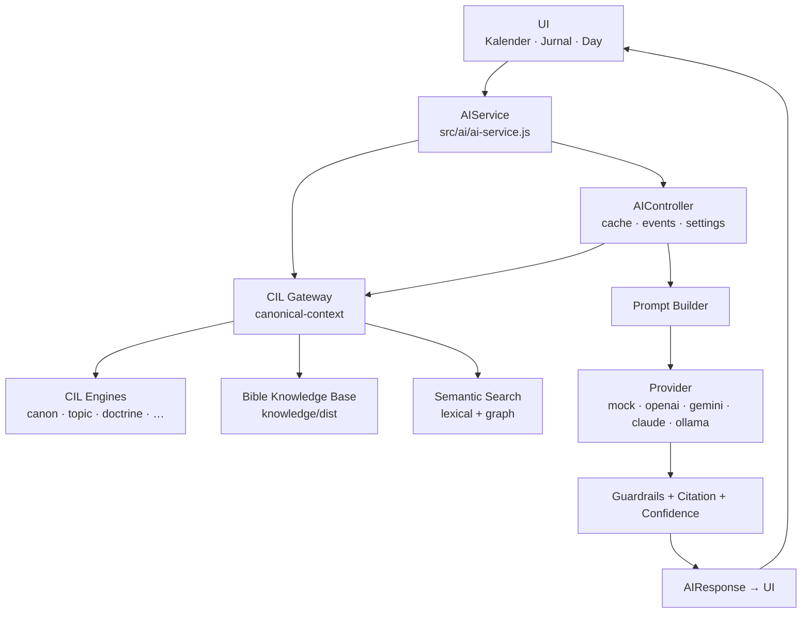
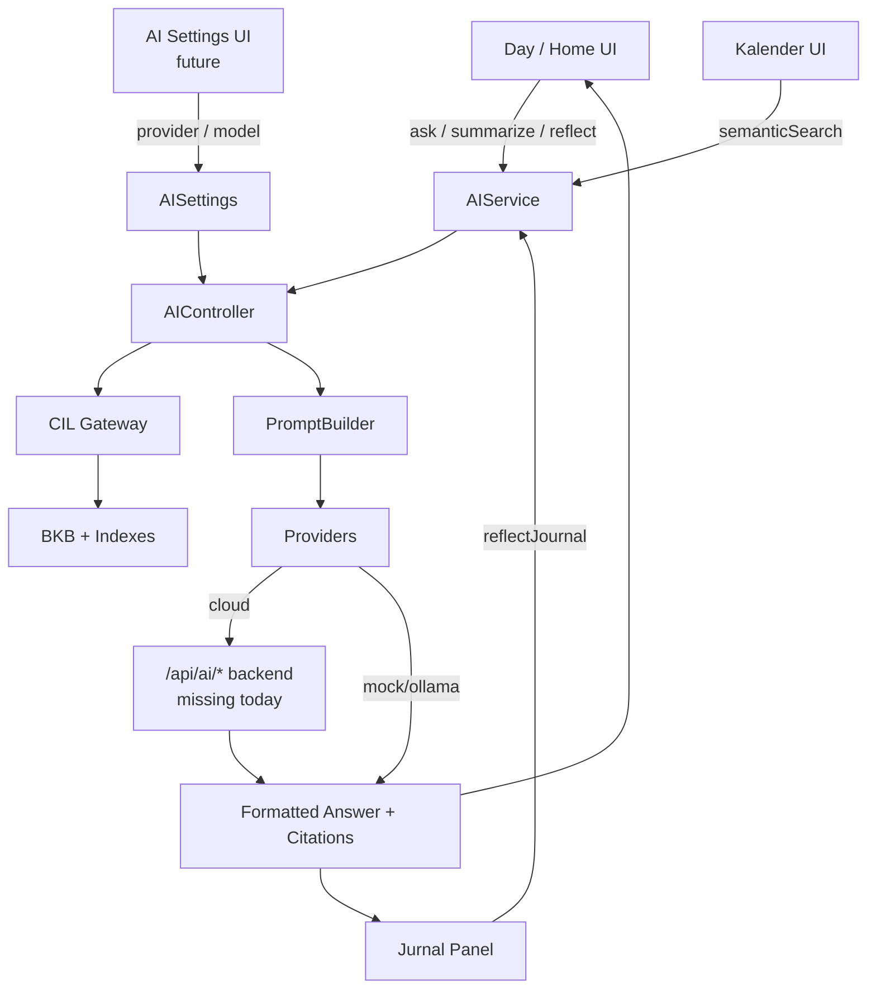

# AI Audit Report — Canonical Intelligence Layer
## AI-07A — Inventory, Gap Analysis & UI Integration Readiness

- **Tanggal audit:** 2026-07-17
- **Proyek:** Bible Time Proverbs Edition (v2.0.0)
- **Lingkup:** Audit saja — tidak ada perubahan fitur, UI, atau refactor
- **Dasar untuk:** AI-07B, AI-07C, AI-08, roadmap AI berikutnya

---

## 1. Executive Summary

Fondasi AI proyek ini **jauh lebih luas di backend daripada yang terlihat di UI**.

Yang sudah kuat dan terbukti lewat test:

- **Canonical Intelligence Layer (CIL)** sebagai gateway tunggal ke Bible Knowledge Base
- **Bible Knowledge Base (BKB)** offline dengan 481 dokumen, chunking, index, graph
- **Semantic Search** (lexical + ontology + knowledge graph) dengan panel UI di Kalender
- **Journal AI Reflection** dengan consent eksplisit (provider default = **mock**)

Yang masih prototype / belum ke pengguna:

- Intent generatif `ask`, `summarize`, `reflect`, `explain`, `search` (LLM synthesis), `wisdom` — **engine siap, UI belum**
- Provider cloud (OpenAI / Gemini / Claude) — adapter ada, **proxy backend `/api/ai/*` tidak ada di repo**
- Embeddings / vector search — field disiapkan (`vectorReady: false`), **belum aktif**
- Review Engine / Wisdom Coach / Prayer Generator sebagai produk terpisah — **belum ada**

**Kesimpulan utama:** proyek siap untuk **AI-07B — AI UI Integration** (menghubungkan engine yang sudah ada ke permukaan pengguna), bukan membangun engine baru dari nol. AI-08 (Multi-Book) masuk akal setelah surface Q&A/Summary/Reflect terintegrasi dan BKB diperluas.

---

## 2. AI Architecture Overview



**Alur generatif (LLM):**  
UI → `AIService` → `AIController` → CIL `buildCanonicalContext` → `PromptBuilder` → Provider → Theological Guardrails / Citation → `AIResponse`

**Alur semantic (non-LLM):**  
UI Kalender → `AIService.semanticSearch` → CIL Gateway → `SemanticSearchEngine` → hasil lokal offline

**Catatan arsitektur:**

- `AIController` menyimpan `contextBuilder` dan `retrievalEngine`, tetapi `execute()` memakai gateway secara langsung (adapter legacy bypassed).
- Semantic search aktif adalah **semantic-lexical-graph**, bukan embedding/vector.

---

## 3. AI Inventory

### Lokasi utama

| Area | Path |
| --- | --- |
| Public AI facade | `src/ai/ai-service.js` |
| Orchestration | `src/ai/ai-controller.js` |
| CIL | `src/ai/cil/**` |
| Knowledge runtime | `src/ai/knowledge/**` |
| Prompts | `src/ai/prompts/**` |
| Providers | `src/ai/providers/**` |
| Config | `config/ai.config.js` |
| Knowledge SSOT | `knowledge/**` |
| UI AI | `js/ui/semantic-search-ui.js`, `js/ui/ai-reflection-panel.js` |
| Legacy search | `js/search.js` |
| Docs | `docs/AI-ARCHITECTURE.md`, `CIL-ARCHITECTURE.md`, `KNOWLEDGE-ARCHITECTURE.md`, `SEMANTIC-SEARCH.md`, `JOURNAL-ARCHITECTURE.md` |

### Modul AI tingkat tinggi

| Modul | Ada? | Dipakai runtime? | UI? |
| --- | --- | --- | --- |
| AIService facade | ✅ | ✅ | ✅ (sebagian) |
| CIL Gateway | ✅ | ✅ | Indirect |
| BKB / RAG prep | ✅ | ✅ | Indirect |
| Semantic Search | ✅ | ✅ | ✅ Kalender |
| Journal Reflection AI | ✅ | ✅ | ✅ Jurnal |
| Q&A / Summary / Reflect / Explain | ✅ API | ⚠️ test only | ❌ |
| Wisdom Coach (produk) | ⚠️ partial | ❌ | ❌ |
| Review Engine | ❌ | — | — |
| Vector / Embeddings | ⚠️ placeholder | ❌ | ❌ |
| Cloud LLM proxy | ⚠️ client only | ❌ | ❌ |

---

## 4. Engine Mapping

| Engine | File utama | Digunakan | UI | Status |
| --- | --- | --- | --- | --- |
| AI Orchestration | `ai-service.js`, `ai-controller.js` | ✅ | Journal (partial) | **Beta** |
| Prompt Builder | `prompt-builder.js` | ✅ | Indirect | **Production Ready** |
| CIL Gateway | `cil/gateway.js` | ✅ | Indirect | **Production Ready** |
| Canonical Engine | `cil/engines/canonical-engine.js` | ✅ | Indirect | **Production Ready** |
| Topic Engine | `cil/engines/topic-engine.js` | ✅ | Indirect | **Production Ready** |
| Relationship Engine | `cil/engines/relationship-engine.js` | ⚠️ loaded / test | ❌ | **Prototype** |
| Knowledge Graph (CIL) | `cil/engines/knowledge-graph-engine.js` | ✅ | Indirect | **Production Ready** |
| Doctrine Engine | `cil/engines/doctrine-engine.js` | ✅ | Indirect | **Production Ready** |
| Character Engine | `cil/engines/character-engine.js` | ✅ | Indirect | **Production Ready** |
| Timeline Engine | `cil/engines/timeline-engine.js` | ✅ | Indirect | **Production Ready** |
| Symbol Engine | `cil/engines/symbol-engine.js` | ✅ | Indirect | **Production Ready** |
| Wisdom Engine (CIL data) | `cil/engines/wisdom-engine.js` | ✅ context | ❌ direct | **Production Ready** |
| Application Engine | `cil/engines/application-engine.js` | ✅ | Indirect | **Production Ready** |
| Citation Engine | `cil/citation-engine.js` | ✅ | Indirect | **Production Ready** |
| Confidence Scorer | `cil/confidence.js` | ✅ | Indirect | **Production Ready** |
| Theological Guardrails | `cil/theological-guardrails.js` | ✅ | Indirect | **Production Ready** |
| Knowledge Base (BKB) | `knowledge/knowledge-base.js` | ✅ | Indirect | **Production Ready** |
| Search Engine (BKB lexical) | `knowledge/search-engine.js` | ✅ | Indirect | **Production Ready** |
| Semantic Search Engine | `knowledge/semantic-search.js` | ✅ | ✅ Kalender | **Beta** |
| Query Analyzer | `knowledge/query-analyzer.js` | ✅ | Indirect | **Production Ready** |
| Knowledge Graph (BKB search) | `knowledge/knowledge-graph.js` | ✅ | Indirect | **Beta** |
| Chunker | `knowledge/chunker.js` | ✅ build-time | ❌ | **Production Ready** |
| Knowledge Context Builder | `knowledge/knowledge-context.js` | ⚠️ tests / barrel | ❌ | **Unused** |
| RetrievalEngine (compat) | `retrieval-engine.js` | ⚠️ stored, unused in execute | ❌ | **Prototype** |
| ContextBuilder (compat) | `context-builder.js` | ⚠️ stored, unused in execute | ❌ | **Prototype** |
| SemanticIndex | `semantic-index.js` | ⚠️ validate-ai only | ❌ | **Unused** |
| Legacy CONTENT Search | `js/search.js` | ✅ | Kalender fallback | **Production Ready** |
| Summary (generative) | `AIService.summarize` + prompt | ⚠️ API only | ❌ | **Prototype** |
| Bible Q&A | `AIService.ask` + prompt | ⚠️ API only | ❌ | **Prototype** |
| Reflection (reading) | `AIService.reflect` | ⚠️ API only | ❌ | **Prototype** |
| Journal Reflection | `AIService.reflectJournal` | ✅ | ✅ Panel | **Beta** |
| Explain | `AIService.explain` | ⚠️ API only | ❌ | **Prototype** |
| LLM Search Synthesis | `AIService.search` | ⚠️ API only | ❌ | **Prototype** |
| Wisdom (generative) | prompt + mock; **no `AIService.wisdom()`** | ❌ unreachable | ❌ | **Prototype** |
| Review Engine | — | ❌ | ❌ | **Tidak ada** |
| Prayer Generator | — | ❌ | ❌ | **Tidak ada** |
| Coach / Companion product UI | — | ❌ | ❌ | **Tidak ada** |

---

## 5. UI Mapping

| Capability | Route | Button | Card/Panel | Dialog | Menu/Nav | API | Status UI |
| --- | --- | --- | --- | --- | --- | --- | --- |
| Semantic Search | `calendar` | ✅ input + filters | ✅ panel/cards | ❌ | via Kalender | `semanticSearch` | **Wired** |
| Search suggestions | `calendar` | ✅ | ✅ list | ❌ | — | `suggestSearch` | **Wired** |
| Recent / favorite search | `calendar` | ✅ chips | ✅ | ❌ | — | prefs API | **Wired** |
| Search click analytics | — | internal | — | ❌ | — | `recordSearchClick` | **Internal** |
| Legacy keyword search | `calendar` | fallback | highlight | ❌ | — | `js/search.js` | **Internal** |
| Journal AI Reflection | `home` / `day` | ✅ “Bantu refleksi (AI)” | ✅ answer panel | consent inline | via jurnal | `reflectJournal` | **Wired** |
| Journal AI consent | day journal | ✅ Izinkan / Cabut | ✅ gate | ❌ | — | consent store | **Wired** |
| Bible Q&A (`ask`) | ❌ | ❌ | ❌ | ❌ | ❌ | ✅ | **Need UI** |
| Summarize chapter | ❌ | ❌ | ❌ | ❌ | ❌ | ✅ | **Need UI** |
| Reading Reflect | ❌ | ❌ | ❌ | ❌ | ❌ | ✅ | **Need UI** |
| Explain | ❌ | ❌ | ❌ | ❌ | ❌ | ✅ | **Need UI** |
| LLM Search synthesis | ❌ | ❌ | ❌ | ❌ | ❌ | ✅ | **Need UI** |
| Wisdom Coach | ❌ | ❌ | ❌ | ❌ | ❌ | ❌ (no facade) | **Need API+UI** |
| Provider / model settings | ❌ | ❌ | ❌ | ❌ | ❌ | `AISettings` internal | **Need UI** |
| Conversation history | ❌ | ❌ | ❌ | ❌ | ❌ | `conversation-store` | **Need UI** |
| Canonical context inspector | ❌ | ❌ | ❌ | ❌ | ❌ | `buildCanonicalContext` | **Internal / future** |
| AI events subscription | ❌ | ❌ | ❌ | ❌ | ❌ | `AIService.events` | **Internal** |

`index.html` **tidak** memuat tombol/route AI khusus; AI di-mount dinamis dari `calendar.js` dan `journal-editor.js`.

---

## 6. Knowledge Base Inventory

**Single Source of Truth:** `knowledge/`  
**Runtime bundle:** `knowledge/dist/knowledge.min.json` (+ index/graph/manifest)

| Domain | Ada? | Lokasi |
| --- | --- | --- |
| Book metadata | ✅ | `knowledge/metadata/book-proverbs.json`, `canon/books-registry.json` |
| Chapter bundles | ✅ | `knowledge/books/proverbs/chapter-01..31.json` |
| Verse / golden verse | ✅ | di chapter bundles + indexes |
| Pericope | ⚠️ partial | outline di book metadata; bukan perikop resmi TB per ayat |
| Historical context | ✅ | book metadata + `timeline/events.json` + Timeline Engine |
| Outline | ✅ | `book-proverbs.json` outline sections |
| Theme / keywords | ✅ | book + chapter + `topics/topics.json` |
| People | ✅ | `characters/characters.json`, `indexes/people-index.json` |
| Places | ✅ | `indexes/places-index.json` |
| Timeline | ✅ | `timeline/events.json`, `dist/timeline-index.json` |
| Cross references | ✅ | `crossrefs/crossrefs.json`, `dist/crossref-index.json` |
| Memory / golden verse | ✅ | chapter content + golden-verse docs |
| Prayer | ✅ | sebagai document type + konten harian |
| Reflection | ✅ | document type + konten harian |
| Application | ✅ | `application/applications.json` |
| Wisdom patterns | ✅ | `wisdom/patterns.json` |
| Doctrine | ✅ | `doctrine/doctrines.json` |
| Symbols | ✅ | `symbols/symbols.json` |
| Dictionary | ✅ | `dictionary/dictionary.json` |
| FAQ / Apologetics | ✅ | `faq/faq.json`, `faq/apologetics.json` |
| Commentaries / quotes | ✅ | `commentaries/`, indexes |
| Situations / synonyms | ✅ | `situations/`, `synonyms/` (semantic) |
| Commands / Warnings / Promises | ⚠️ via wisdom/application/topics | tidak sebagai koleksi terpisah bernama itu |
| Chunks | ✅ | `knowledge/dist/knowledge.chunks.json` |
| Graph nodes/edges | ✅ | `knowledge/dist/graph-*.json` |

Schema dokumen seragam: `src/ai/knowledge/schema.js` (`DOCUMENT_TYPES`, embedding placeholders).

---

## 7. Prompt Inventory

| Prompt | File | Intent | Dipakai PromptBuilder? | UI caller? |
| --- | --- | --- | --- | --- |
| Summary | `prompts/summary.prompt.js` | `summary` | ✅ | ❌ |
| Q&A | `prompts/qa.prompt.js` | `qa` (+ fallback) | ✅ | ❌ |
| Explain | (reuse QA) | `explain` | ✅ (via QA template) | ❌ |
| Reflection | `prompts/reflection.prompt.js` | `reflection` | ✅ | ❌ |
| Journal Reflection | `prompts/journal-reflection.prompt.js` | `journal-reflection` | ✅ | ✅ |
| Wisdom | `prompts/wisdom.prompt.js` | `wisdom` | ✅ | ❌ (no `AIService.wisdom`) |
| Search synthesis | `prompts/search.prompt.js` | `search` | ✅ | ❌ |

**Catatan:**

- Runtime prompt ID di-bump CIL (`*.v2`).
- `explain` memakai template QA → identitas prompt sama dengan `qa.v2`.
- Tidak ditemukan system prompt terpisah di luar field `system` tiap template.
- Tidak ada Review / Prayer / Coach prompt khusus.

**Duplicate prompt:** tidak ada file prompt ganda; overlap fungsional hanya **QA reused for Explain**.

---

## 8. RAG Inventory

| Komponen RAG | Status | Catatan |
| --- | --- | --- |
| Knowledge Base | ✅ | BKB offline, validated |
| Chunk | ✅ | build-time (`chunker.js`) |
| Retriever | ✅ | Gateway `retrieve` + SearchEngine |
| Embedding | ⚠️ prepared only | `embeddingStatus: pending`, `vectorReady: false` |
| Metadata | ✅ | schema + indexes |
| Citation | ✅ | `CitationEngine` + cite-only policy |
| Ranking | ✅ | lexical weights + graph boost |
| Hybrid Search | ⚠️ partial | lexical + graph/ontology; **bukan** BM25+vector |
| Cache | ✅ | `ai-cache.js` (+ conversation persist opsional) |
| Prompt Builder | ✅ | token-budgeted + redaction jurnal |
| Answer Builder | ⚠️ light | provider output + guardrails; tidak ada formatter UI generik |

**Kesimpulan RAG:** fondasi RAG **siap untuk retrieval lokal**. Generasi jawaban cloud belum production karena default mock + proxy cloud absen.

---

## 9. Review Engine Inventory

| Fitur Review | Status |
| --- | --- |
| Reflection Review (skor/feedback terstruktur) | ❌ Tidak ada |
| Feedback scoring | ❌ |
| Encouragement engine | ❌ |
| Prayer Generator (terpisah) | ❌ (doa hanya di konten/renungan/prompt reflection) |
| Application Suggestion | ⚠️ data Application Engine ada; tidak ada UI review |
| Theology Checker | ✅ `TheologicalGuardrails` (runtime LLM path) |
| Context Checker | ✅ confidence + coverage di CIL |
| Journal draft apply questions | ⚠️ UI callback `{questions:true}` tidak cocok dengan cek `draft.questions?.length` |

**Kesimpulan:** Review Engine sebagai produk **belum dibangun**. Guardrail teologi sudah ada di jalur LLM.

---

## 10. Semantic Search Inventory

| Fitur Search | Status | Lokasi |
| --- | --- | --- |
| Keyword / substring (legacy) | ✅ | `js/search.js` |
| Weighted lexical (BKB) | ✅ | `knowledge/search-engine.js` |
| Semantic (ontology + situation + graph) | ✅ | `knowledge/semantic-search.js` + UI |
| Vector search | ❌ | placeholder only |
| Hybrid BM25+vector | ❌ | |
| Cosine similarity | ❌ (mock embeddings unused) | |
| BM25 | ❌ | custom weighted lexical |
| Metadata filter | ✅ | type/topic filters di UI |
| Ranking | ✅ | score + graph expansion |
| Reranking (learned) | ❌ | |
| Suggest / related | ✅ | analyzer + related buckets |
| Analytics | ✅ record; ❌ no UI dashboard | `search-analytics.js` |

---

## 11. LLM Inventory

| Provider | Adapter | Default | Transport | Backend di repo | Streaming | Embeddings | Status |
| --- | --- | --- | --- | --- | --- | --- | --- |
| Mock | ✅ | ✅ **ya** | in-process | n/a | ✅ simulated | ✅ deterministic 16D (unused by search) | **Production (dev/demo)** |
| OpenAI | ✅ | no | `/api/ai/openai` | ❌ absen | no | no | **Adapter only** |
| Gemini | ✅ | no | `/api/ai/gemini` | ❌ absen | no | no | **Adapter only** |
| Claude | ✅ | no | `/api/ai/claude` | ❌ absen | no | no | **Adapter only** |
| Ollama | ✅ | no | `localhost:11434` | butuh Ollama lokal | no | no | **Dev optional** |
| LM Studio | ❌ | — | — | — | — | — | **Tidak ada** |

Tidak ada UI ganti provider/model. Credential cloud memang tidak disimpan di frontend (desain proxy).

---

## 12. Duplicate Analysis

| Area | Temuan | Risiko |
| --- | --- | --- |
| Context builders | Gateway (aktif) vs `ContextBuilder` vs `KnowledgeContextBuilder` vs `PromptBuilder.serializeContext` | Debt / kebingungan maintainer |
| Knowledge graphs | CIL `knowledge-graph-engine` vs BKB `knowledge-graph` | Dua konvensi ID/edge |
| Search stacks | `js/search` + BKB SearchEngine + SemanticSearch + Gateway retrieve + SemanticIndex | Overlap; SemanticIndex mati |
| Text normalize | `js/search.normalize` vs `ai-utils.normalizeText` | Perilaku sedikit berbeda |
| Escape HTML | **Tidak duplikat** (sudah tunggal di `js/utils/security.js`) | Baik |
| Prompt explain/qa | Satu template untuk dua intent | Identitas prompt kabur |
| Summary konten | Ringkasan editorial di data harian vs `AIService.summarize` | Bukan bug; permukaan produk berbeda |

---

## 13. Dead Module Analysis

| Modul | Bukti “dead / dormant” |
| --- | --- |
| `src/ai/semantic-index.js` | Hanya `validate-ai.mjs` |
| `src/ai/knowledge/knowledge-context.js` | Barrel + tests; bukan path gateway |
| `retrieval-engine.js` pada execute path | Di-inject ke controller, tidak dipanggil |
| `context-builder.js` pada execute path | Sama; diganti `gateway.toLegacyContext()` |
| `AIService.wisdom` path | Prompt/engine ada; **tidak ada method public** |
| `RelationshipEngine.related()` | Load edges; query API terutama test |
| `AIService.ask/summarize/search/reflect/explain` | Tidak ada caller UI |
| `AIService.relatedSearch` | Tidak ada caller UI langsung |
| `AIService.getSearchAnalytics` / events | Tidak di-surface ke UI |
| Cloud providers efektif | Tidak berfungsi tanpa backend proxy |

---

## 14. Technical Debt

1. Facade AI lebih luas daripada surface produk → risiko “API mati” membingungkan.
2. Compatibility adapters (`retrieval-engine`, `context-builder`) masih menempel di controller tanpa dipakai execute.
3. Dua implementasi knowledge graph.
4. Embeddings diiklankan di schema/docs tetapi belum terhubung ke search.
5. Proxy `/api/ai/*` didokumentasikan / dikonfigurasi, belum diimplementasi di repo.
6. Journal AI default mock tanpa label jelas “contoh / mock” di UI.
7. Callback apply draft jurnal (`questions: true`) tidak selaras dengan konsumen.
8. `explain` tidak buffered sebagai guarded intent meskipun divalidasi belakangan.
9. Tidak ada cancellation API di `AIService` meski controller mendukung cancel.
10. Analytics search tercatat tanpa dashboard.

---

## 15. Production Readiness

### Production Ready (fondasi / offline)

- CIL Gateway + sebagian besar domain engines
- BKB load/search/chunk/schema/citation/confidence/guardrails
- Prompt Builder
- Legacy keyword search
- Mock provider (untuk demo offline)

### Beta (siap dipakai pengguna terbatas)

- Semantic Search UI (Kalender)
- Journal AI Reflection UI (mock default)
- BKB Knowledge Graph untuk ranking semantic

### Prototype (engine/API ada, produk belum)

- Generative Q&A / Summary / Reflect / Explain / LLM Search
- Wisdom generative path
- Cloud/Ollama providers
- Relationship engine query surface
- Retrieval/Context compatibility wrappers

### Unused / Not built

- SemanticIndex runtime
- KnowledgeContextBuilder runtime
- Review Engine, Prayer Generator, Coach UI, Vector search, Provider settings UI

---

## 16. Gap Analysis

| Modul | Engine | UI | Status | Progress (perkiraan) |
| --- | --- | --- | --- | --- |
| Semantic Search | ✅ | ✅ | Beta | **90%** |
| Journal Reflection AI | ✅ | ✅ | Beta (mock) | **75%** |
| CIL / Canonical Context | ✅ | ❌ inspector | Production (internal) | **95%** |
| Bible Q&A | ✅ | ❌ | Prototype | **85%** engine / **10%** product |
| Chapter Summary AI | ✅ | ❌ | Prototype | **85%** / **5%** |
| Reading Reflection AI | ✅ | ❌ | Prototype | **80%** / **5%** |
| Explain | ✅ (reuse QA) | ❌ | Prototype | **70%** / **0%** |
| LLM Search Synthesis | ✅ | ❌ | Prototype | **70%** / **0%** |
| Wisdom Coach | ⚠️ data+prompt | ❌ | Prototype | **55%** / **0%** |
| Cloud LLM | ⚠️ adapters | ❌ | Blocked by backend | **40%** |
| Vector / Embeddings | ⚠️ fields | ❌ | Future | **15%** |
| Review Engine | ❌ | ❌ | Missing | **0%** |
| Multi-book Companion | ❌ (Proverbs only) | ❌ | AI-08 | **20%** (pola BKB ada) |
| Provider Settings | ⚠️ store | ❌ | Missing UI | **30%** |
| Conversation History | ⚠️ IDB | ❌ | Missing UI | **35%** |

---

## 17. Prioritas Integrasi

### P0 — AI-07B (UI Integration, nilai pengguna tertinggi)

1. **Ask This Chapter / Bible Q&A** di halaman hari (button + panel streaming)
2. **Summarize chapter** (ringkas AI di samping teks pasal)
3. **Reading Reflect** (bukan hanya journal) dengan consent yang jelas
4. Label eksplisit bila provider = mock; opsi Ollama untuk power user
5. Perbaiki apply-draft journal questions

### P1 — Stabilisasi produksi LLM

1. Implementasi proxy `/api/ai/*` (Vercel/Cloudflare Function)
2. UI settings provider/model/language/length
3. Expose `AIService.wisdom()` + panel Wisdom Coach ringan
4. Samakan guard buffering untuk `explain`

### P2 — AI-07C / kualitas retrieval

1. Konsolidasi atau dokumentasikan dual graph
2. Hapus/arsip path mati (`SemanticIndex` runtime, unused context builder) **setelah** keputusan arsitektur
3. Dashboard analytics search (opsional)
4. Persiapan embeddings (hybrid) tanpa merusak search lokal

### P3 — AI-08 Multi-Book

1. Perluas BKB di luar Amsal memakai schema yang sama
2. Canonical book registry multi-kitab
3. Companion UI lintas kitab setelah Q&A/Summary terintegrasi

---

## 18. Rekomendasi Roadmap

### Sudah Production Ready
- CIL + BKB offline
- Citation / confidence / theological guardrails
- Semantic lexical+graph search (inti)
- Prompt templates & mock provider

### Perlu Integrasi UI → **AI-07B**
- `ask`, `summarize`, `reflect`, `explain`
- Wisdom facade + panel
- Provider settings
- Conversation history (opsional)

### Perlu Penyempurnaan
- Journal AI (mock labeling, apply draft)
- Explain prompt identity & guarding
- Cloud proxy backends

### Perlu Refactor (nanti, bukan sekarang)
- Dual knowledge graph
- Controller-held unused adapters
- Multiple context serializers

### Prototype
- Generative intents tanpa UI
- Relationship query API
- Vector fields

### Tidak Dipakai / Belum Dibangun
- SemanticIndex production path
- KnowledgeContextBuilder production path
- Review Engine, Prayer Generator, Coach product
- LM Studio

### Rekomendasi keputusan

**Lanjut ke: AI-07B — AI UI Integration**

Alasan: engine & CIL sudah matang; gap terbesar adalah permukaan pengguna dan backend LLM nyata. AI-08 Multi-Book lebih aman setelah Q&A/Summary terhubung ke satu kitab (Amsal) dengan UX yang konsisten.

---

## Bonus — Diagram integrasi target (AI-07B)



---

## FINAL SUMMARY

```text
=====================================
AI AUDIT SUMMARY

Total AI Modules :        32 (engines + services + search + prompts + providers)
Production Ready :        15
Beta :                    3  (Semantic UI, Journal AI, BKB search-graph)
Prototype :               10 (generative intents, cloud adapters, relationship, wrappers)
Unused / Dormant :        4  (SemanticIndex, KnowledgeContextBuilder runtime, unused execute adapters)
Not Built :               3  (Review Engine, Prayer Generator, Coach product UI)
Duplicate / Overlap :     5  (context×4 layers, graphs×2, search stacks, normalize×2, QA/Explain)
Need UI Integration :     6  (ask, summarize, reflect, explain, LLM search, wisdom)
Need Backend / Proxy :    3  (openai, gemini, claude)
Need Refactor :           3  (dual graph, dead adapters, facade breadth)
Need Documentation :      2  (runtime “semantic ≠ vector”; mock-as-default UX honesty)

=====================================
RECOMMENDATION

Lanjut ke:
AI-07B — AI UI Integration

(Alternatif kemudian: AI-08 — Multi-Book Bible Companion
setelah surface Q&A/Summary/Reflect stabil di Amsal.)

=====================================
```

---

*Laporan ini bersifat audit inventaris. Tidak ada perubahan kode fitur/UI yang dilakukan sebagai bagian dari AI-07A.*
